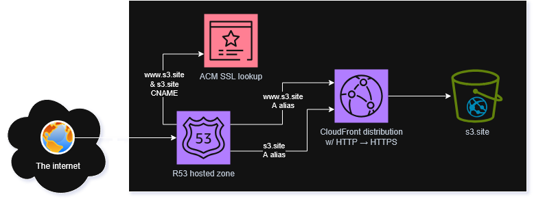

# tf-cloudfront-s3-website
Reference this terraform module to deploy a static website to S3 and distribute using CloudFront. Compatible with domains registered through Route 53 and any other registrars.

To reference this module from a `*.tf` file, specify the source
```
source = "git::https://github.com/ruyda/tf-cloudfront-s3-website.git"
```

An example of a module with all inputs specified
```
module "cloudfront-s3-website" {
  source                = "git::https://github.com/ruyda/tf-cloudfront-s3-website.git"
  aws_region            = "us-east-1
  dns_type              = "NO_ROUTE_53"
  use_existing_ssl_cert = true
  use_access_logging    = true
  domain                = "domain.com"
  website_contents_path = "./website"
}
```

### Deployed resources



### Design goals

- Serverless
- Handle http://domain, http://www.domain, https://domain, & https://www.domain with minimal infrastructure
- Handle Route 53 domains with or without existing hosted zones, as well as domains using other DNS services
- Cost optimization (reason for not using a long running solution like an EC2 instance)

### Variable inputs

| Name                      | Description                                                             |
|---------------------------|-------------------------------------------------------------------------|
| **aws_region**            | The AWS region to deploy the website infrastructure                     |
| **dns_type**              | <ul><li>`NEW_ROUTE_53` creates a new hosted zone for a domain registered with Route 53</li><li>`EXISTING_ROUTE_53` looks up an existing hosted zone associated with your domain</li><li>`NO_ROUTE_53` omits Route 53 resources</li></ul> An SSL certificate must be uploaded to ACM regardless of DNS type |
| **use_existing_ssl_cert** | Set true to use an existing ACM certificate associated with your domain |
| **use_access_logging**    | Set true to create an S3 bucket to hold server access logs              |
| **domain**                | The domain (excluding `http(s)://www.`); example: `google.com`          |
| **website_contents_path** | The string ./path/to/website/contents excluding trailing slash          |
| **distribution_caching_policy_id** | (optional) The AWS or custom cache behavior policy ID assigned to the CloudFront distribution; default is CachingDisabled |
| **origin_request_policy_id**       | (optional) The AWS or custom origin request policy ID assigned to the CloudFront distribution; default is CORS-S3Origin   |

### Usage notes
Terraform is aware of file changes in the path given to `website_contents_path`. A change to a file in this directory will trigger Terraform to reupload the file to S3. Unchanged files are not reuploaded.

If this module creates a new Route 53 hosted zone (`dns_type = "NEW_ROUTE_53"`), it will take some time to sync the domain with the new name servers. To see if the sync is complete, you can run `nslookup <domain.com>` to see if your domain is accessible from the internet.

While this sync is in progress, if this module also created an SSL certificate (`use_existing_ssl_cert = false`), ACM will be pending validation with the domain. This validation will not succeed until some time after the name server sync is complete.

The terraform deployment waits for these steps complete before creating CloudFront resources. It can take up to 15 minutes.

### Issues
Use the GitHub Issues feature to report issues and discuss usage of this module.

### Related projects
- API gateway back end to pair with this S3 stored front end  [ 🔗 view GitHub](https://github.com/ruyda/tf-serverless-backend)
- (Coming soon) Mnecraft server (1.28) serverless hosting with EC2

### License
GPL2 - keep it open source.

Licensed under the GNU General Public License Version 2.0 (or later); you may not use this work except in compliance with the License. You may obtain a copy of the License in the LICENSE file, or at:

https://www.gnu.org/licenses/old-licenses/gpl-2.0.txt
